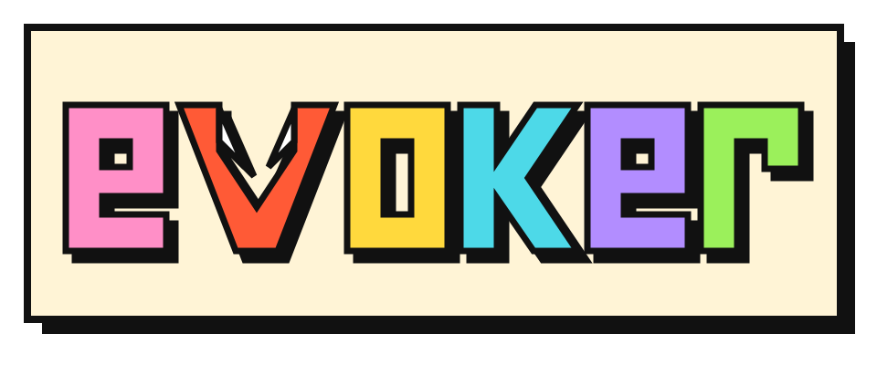

<div align="center">

<h1></h1>

**A package manager for Minecraft servers.**

Declare the server software, mods, plugins and packs in one file.<br>
evoker installs them with their dependencies, locks the exact versions, keeps them updated, and runs the server.

[](https://github.com/gavinhsmith/evoker/releases/latest)
[](https://github.com/gavinhsmith/evoker/releases)
[](https://github.com/gavinhsmith/evoker/actions/workflows/ci.yml)
[](LICENSE.md)


[Install](#install) · [Quick start](#quick-start) · [Documentation](https://github.com/gavinhsmith/evoker/wiki) · [Report a bug](https://github.com/gavinhsmith/evoker/issues)

</div>

```sh
evoker init fabric 1.21.4   # describe the server (then set "eula": true)
evoker add lithium          # mods and plugins from Modrinth or Hangar, dependencies included
evoker start                # download what's missing, lock it, run the server
```

## Why evoker

Running a modded or plugin server usually means hunting down jars, matching versions by hand, and hoping the next machine ends up with the same files. evoker treats the server like a software project:

- **One file describes the server.** `evoker.json` lists the software, the game version, your content and your `server.properties` settings. Commit it.
- **Reproducible installs.** `evoker.lock` pins every jar to an exact version and SHA-256, like `package-lock.json` or `Cargo.lock`. Any machine gets byte-for-byte the same server.
- **Dependencies handled.** Required dependencies are resolved recursively and removed again when nothing needs them.
- **Safe upgrades.** `evoker upgrade --list` shows what a new game version would change. Anything without a compatible release keeps its current version instead of breaking your setup.
- **Modpacks in one command.** `evoker import <modpack>` turns a Modrinth `.mrpack` into a server, keeping only the server-side mods.
- **It runs the server.** evoker starts the server as a child process: same console, same Ctrl+C, same exit code.
- **Git-friendly.** `evoker init --git` writes a `.gitignore` that tracks your configs and ignores everything evoker can download again.

## Supported

**Server software:** Vanilla · Paper · Purpur · Spigot (built with BuildTools) · Fabric · Quilt · NeoForge

**Content:** [Modrinth](https://modrinth.com) (mods, plugins, data packs, resource packs, modpacks) · [Hangar](https://hangar.papermc.io) (Paper plugins) · any URL

Runs on Windows, Linux and macOS with Java 21 or newer.

## Install

```sh
# Linux / macOS
curl -fsSL https://raw.githubusercontent.com/gavinhsmith/evoker/main/install.sh | bash
```

```powershell
# Windows (PowerShell)
irm https://raw.githubusercontent.com/gavinhsmith/evoker/main/install.ps1 | iex
```

This installs the latest release and an `evoker` command. You can also download `evoker.jar` from the [releases](https://github.com/gavinhsmith/evoker/releases/latest) and run `java -jar evoker.jar`. More options: [Getting Started](https://github.com/gavinhsmith/evoker/wiki/Getting-Started).

## Quick start

```sh
mkdir my-server && cd my-server
evoker init paper 1.21.4 --git
```

Edit `evoker.json`. Setting `"eula": true` accepts the [Minecraft EULA](https://aka.ms/MinecraftEULA):

```json
{
  "server": { "software": "paper", "version": "1.21.4", "build": "latest" },
  "eula": true,
  "properties": { "motd": "My server", "max-players": 20 },
  "content": {},
  "evoker": { "jvmArgs": ["-Xmx4G"] }
}
```

Add content and start:

```sh
evoker add luckperms             # Modrinth
evoker add hangar:ViaVersion     # Hangar
evoker add https://example.com/MyPlugin.jar --type plugin   # anything else
evoker start
```

Or start from a modpack:

```sh
evoker import cobblemon-fabric
```

## Commands

| Command | |
|---|---|
| `evoker init [software] [version] [--git]` | Create `evoker.json` (and optionally a git repo) |
| `evoker add <slug> [version]` | Add a mod or plugin with its dependencies |
| `evoker remove <slug>` | Remove it and whatever only it needed |
| `evoker import <pack>` | Import a Modrinth modpack (slug, `.mrpack` file or URL) |
| `evoker install` | Download whatever is missing |
| `evoker update [slug]` | Move `latest` entries to their newest versions |
| `evoker upgrade [--list]` | Move everything, pins included, to the newest versions for the game version |
| `evoker start` | Install, then run the server |
| `evoker list [--output=json]` | Show what's installed: versions, pins, dependencies |
| `evoker command` | Print the launch command, for systemd, Docker or a panel |

Full reference: [Commands](https://github.com/gavinhsmith/evoker/wiki/Commands) · [evoker.json](https://github.com/gavinhsmith/evoker/wiki/evoker-json) · [evoker.lock](https://github.com/gavinhsmith/evoker/wiki/evoker-lock) · [Server Software](https://github.com/gavinhsmith/evoker/wiki/Server-Software) · [Content Sources](https://github.com/gavinhsmith/evoker/wiki/Content-Sources)

## Feedback

evoker is young (0.x). If something doesn't work with your server, a mod, or a plugin, please [open an issue](https://github.com/gavinhsmith/evoker/issues). Ideas and questions are welcome in [Discussions](https://github.com/gavinhsmith/evoker/discussions). A ⭐ helps other server owners find it.

## Contributing

**Prerequisites:** JDK 21 and git. Maven is not needed; use the wrapper.

```sh
./mvnw verify                  # build + unit and integration tests (offline)
./mvnw verify -Plive           # only the tests against the real Modrinth/Hangar/server APIs
java -jar target/evoker.jar    # run the build
```

On Windows use `mvnw.cmd`. `JAVA_HOME` must point at the JDK folder (not its `bin`).

- Branch from `main`, open a PR; CI must pass on Linux and Windows.
- Commit messages: `[tag] summary`, e.g. `[modrinth] resolve required dependencies`.
- New logic needs a unit test; a new API client needs fixtures and an integration test.
- Docs live in [`wiki/`](wiki/) and are synced to the GitHub Wiki on every push to `main`. Update them with behavior changes.
- Releases: a maintainer pushes a tag (`git tag v0.3.0 && git push origin v0.3.0`) and CI publishes `evoker.jar` to GitHub Releases.

Coding agents: see [AGENTS.md](AGENTS.md).

## License

[Apache 2.0](LICENSE.md). evoker is not affiliated with Mojang, Microsoft, Modrinth or PaperMC.
